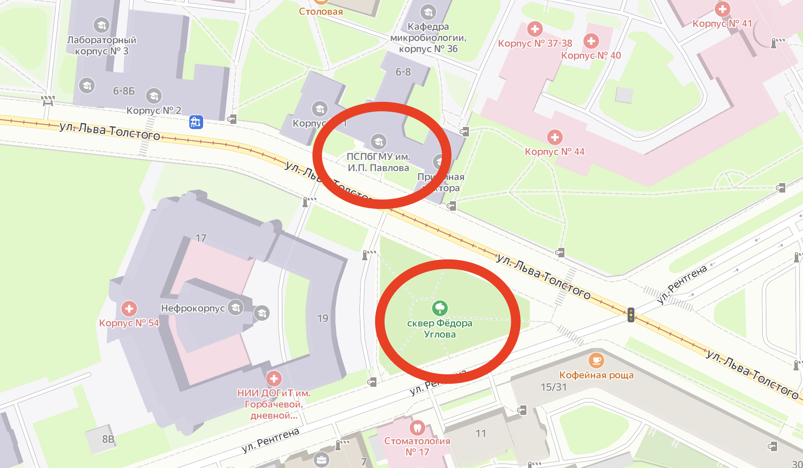

## Занятие № 1.
Нажмите на картину для перехода на YouTube

## Обращение к пьющему
Ты пришел в клуб и увидел людей, которые не пьют, работая по программе. Они тебе сказали, что надо вести дневники. Ты, конечно, посмеялся про себя: «<u>Какие такие дневники</u>, мне матерому пьянице! Да, я вам школьник, что ли, писать по ночам? Мне надо что-то более серьезное…» Каждый из нас хочет бросить по своему рецепту. Ну, и к чему тебя привели твои эксперименты? Снова пьянка и снова запой. Тебе же нужна ТРЕЗВОСТЬ, а ты видишь людей, которые не пьют более пяти и десяти лет. Тебе нужна Трезвость, и тебе ее предлагают. А ты говоришь, что тебе такая Трезвость не нужна, потому что надо что-то писать, а я так пить не брошу. У каждого из нас были такие мысли, и мы тоже не верили в это, но решили попробовать, попробуй и ты

## Притча № 1.
> *А ты наберись смелости – попробуй, сделай попытку*

«Дочку и полцарства в придачу! — сказал король, — тому, кто откроет самый сложный и тяжелый в нашем королевстве замок». Знатные вельможи, блистающие золотом и умом, вышли на встречу королю. Он подвел их к замку, на котором было более тысячи задвижек и отверстий. Мудрецы-вельможи стали разглядывать замок, но так и не прикоснувшись к нему признались, что они не могут открыть этот чудо-замок. «Если уж мудрецы не смогли открыть, — шептали другие придворные, — то где уж нам это сделать». И даже не осмелились подойти к загадочной груде железа. Все люди королевства потупили свой взор и только отрицательно качали головой. Лишь один добрый молодец подошел к замку, покачал его из стороны в сторону и, наконец, взявшись за дужку, рывком открыл. Оказывается, замок не был даже защелкнут. Тогда царь, обратившись к принцессе, сказал: «Дочка, за этим человеком ты будешь, как за каменной стеной, потому что у него есть собственное мнение, и он набрался смелости и сделал попытку!»

# Дневник № 1.

### Оружие против России
> [Обращение 1700 врачей в Государственную Думу, в Совет Федераций, ко всем гражданам России](http://uglov-fund.ru/biblioteka/knigi/samoubiytsy-1995/51/)

Дорогие соотечественники!

Дорогие братья и сестры!

Мы, врачи, профессора, академики медицины, обращаемся к вам с просьбой обсудить и вынести решение об официальном признании наркотиками алкоголя и табака, получивших массовое распространение в нашей стране, причинивших и причиняющих огромный вред человеку и обществу, ставящих под угрозу само существование нашего Отечества как культурного государства

Все выдающиеся ученые мира, как прошлого, так и настоящего, бескомпромиссно установили, что алкоголь является сильным наркотическим ядом

> **А.Н. Тимофеев** в книге «<u>Нервно-психические нарушения при алкогольной интоксикации</u>» (Л., 1955 г.) пишет: «*Алкоголь относится к наркотическим веществам жирного ряда, действующим парализующим образом на любую живую клетку… особенно на клетку коры головного мозга… оказывает парализующие действия на высшие отделы центральной нервной системы (ЦНС) растормаживает механизмы нижележащих отделов. Этим объясняется возбужденное поведение человека, так как тормозной процесс в высших отделах уже пострадал*»

> **В.К. Федоров**, ближайший ученик **И. П. Павлова**, в статье «<u>О начальном влиянии наркотиков (алкоголя и хлоралгидрата)</u>» утверждает, что «*…алкоголь есть наркотик, и как всякий наркотик, имеет свои особенности и лишь в деталях отличается от других наркотиков: все фазы влияния алкоголя на ЦНС растянуты, …эйфория при алкоголе более отчетливая, чем и объясняется тяготение в человеческом обществе к алкоголю*» («<u>Труды физиологической лаборатории И. П. Павлова</u>», 1949 г.)

> **А.И. Введенский**: «*Алкоголь относится к наркотическим ядам, из всех тканей тела имеет наибольшее сродство к ЦНС*» («<u>О вменяемости алкоголиков</u>», М., 1935 г.)

> **Н.Е. Введенский** пишет (П. С. П., т. 7, Л., 1963 г., ст. «<u>О действии алкоголя на человека</u>»): «*Действие алкоголя во всех содержащих его спиртных напитках (водки, ликеры, вина, пиво и т. д.) на организм сходно с действием наркотических веществ и типичных ядов (таких, как хлороформ, эфир, опий и т. д.)*»

Особо опасное действие алкоголь оказывает на организм ребенка. По данным фармаколога **Н. Н. Кракова**, у детей, не достигших возраста десяти лет, сильный токсический эффект, то есть отравление и даже смерть, наблюдается при дозе от 2-3-х столовых ложек водки, что соответствует приблизительно 15 гр. Чистого алкоголя (цит. по: **Ю. Груббе**. «<u>Алкоголь, семья, потомство</u>», 1974 г.)

В 1975 г. **Всемирная ассамблея здравоохранения** вынесла решение «*[считать
алкоголь наркотиком, подрывающим здоровье](https://apps.who.int/iris/bitstream/handle/10665/93019/WHA28.81_eng.pdf?sequence=1&isAllowed=y)*». В <u>Большой Советской Энциклопедии</u> (т. 2, стр. 116) сказано, что «*алкоголь относится к наркотическим ядам*». Несмотря на все эти научные данные, в нашей стране имеет место странный парадокс: наркотический яд свободно продается даже в гастрономических магазинах. Из всех наркотиков только алкоголь и табак не находятся под запретом законов, потому что они служат оружием могущественной мафии для ее обогащения, а также для эксплуатации людей и для свершения многих бесчеловечных преступлений

Беды, которые они наносят человечеству, далее нетерпимы

<u>Алкоголь и табак</u> разрушают здоровье миллионов людей, уменьшают продолжительность жизни человека на 16-20 лет, способствуют росту преступности, снижают производительность труда, являются причиной брака и аварий на производстве, разваливают экономику. Но самое губительное действие алкоголь оказывает на мозг и репродуктивные органы, что ведет к разрушению и гибели не только настоящего, но и будущего человека как разумного существа. Установлено, что даже кружка пива вызывает структурные изменения в организме. При длительном употреблении алкоголя имеет место перерождение тканей и атрофия их, что особенно резко и рано проявляется в мозгу. Сначала происходит атрофия больших полушарий и мозжечка, разряжение и запустение их коры в связи с гибелью корковых нейронов (**В. К. Болецкий** «<u>Тезисы научной конференции</u>» – М., 1955 г.). Изменение структуры головного мозга возникает уже при «умеренном» потреблении алкоголя. Шведские ученые установили, что уже после 4-х лет потребления алкоголя имеет место сморщенный мозг из-за гибели миллиардов корковых клеток. Сморщенный мозг наблюдается у «умеренно» пьющих в 85 % случаев. («<u>Наука и жизнь</u>», № 10., 1985 г.). Уже давно лучшие умы человечества требовали запретить производство и потребление этих ядовитых веществ, распространив на них закон о борьбе с наркоманией. 80 лет назад 800 врачей из Англии, Германии, Австрии обратились с воззванием прекратить считать алкоголь пищевым продуктом и отнести его к наркотикам. Но тогда силы врагов трезвости были сильнее, и врачам не удалась их благородная миссия. Ныне мы вновь поднимаем свои голоса за спасение людей

Мы – люди самой гуманной профессии, призванные защищать жизнь и здоровье людей, – не можем далее терпеть, что в нашей стране от причин, связанных с потреблением алкоголя и табака, ежегодно погибают около миллиона человек и рождается более 200 тысяч дефективных и дебильных детей. Наконец, здравый смысл требует решить этот вопрос логично и законно

Почему <u>алкоголь и табак</u>, которые по своему губительному действию ничем не отличаются от других наркотических средств – таких, как морфий, опий, марихуана, эфир и т. д., – а приносят вред в десятки и сотни раз больше, чем все они, вместе взятые, почему они не подчинены закону о борьбе с наркоманией? Может быть, потому, что на алкоголе и табаке зарабатывают больше, чем на других наркотиках, что с их помощью можно погубить больше людей, что они позволяют совершать темные дела менее заметно? Так не пора ли нам перестать следовать указаниям мафии, наживающей на убийстве людей горы золота?

<u>Для признания алкоголя и табака наркотиками</u> и распространения на них закона о борьбе с наркоманией в международном масштабе необходимо решение ООН. Однако в этой организации нельзя исключить сильное влияние коммерческих интересов винно-водочной промышленности. Поэтому мы вправе решить этот вопрос внутри своей страны по примеру ряда арабских стран

Учитывая, что потребление алкоголя и табака в нашей стране получило распространение, не имеющее себе равного в мире, учитывая огромные нравственные, демографические, экономические и экологические потери, которые понесли и продолжают нести наш народ и государство, учитывая, что дальнейшее отношение к алкоголю как пищевому продукту и свободная продажа его грозят полным подрывом здоровья, жизни и будущности нашего народа и могут закончиться катастрофой в самом недалеком будущем, – мы, врачи всех специальностей, вносим предложение: официально <u>признать алкоголь и табак наркотиками</u> и распространить на них закон о защите населения от наркомании»

Второй аспект проблемы – это вопрос: умеренное потребление или трезвость? По существу – это гвоздь всей проблемы. Позиция защитников «умеренного» потребления ошибочна в своей основе, так как она исходит из ложной предпосылки о существовании меры в потреблении алкоголя – наркотического яда. Если согласиться с тем, что для яда существует мера, то можно пускать в свободную продажу все виды наркотиков с предписанием употреблять их «умеренно». И весь народ погибнет от наркомании

-------

Письмо подписали академики медицинских наук России: **[Ф. Г. Углов](https://ru.wikipedia.org/wiki/%25D0%25A3%25D0%25B3%25D0%25BB%25D0%25BE%25D0%25B2,_%25D0%25A4%25D1%2591%25D0%25B4%25D0%25BE%25D1%2580_%25D0%2593%25D1%2580%25D0%25B8%25D0%25B3%25D0%25BE%25D1%2580%25D1%258C%25D0%25B5%25D0%25B2%25D0%25B8%25D1%2587)** (Санкт-Петербург), **[В. В. Кованов](https://ru.wikipedia.org/wiki/%25D0%259A%25D0%25BE%25D0%25B2%25D0%25B0%25D0%25BD%25D0%25BE%25D0%25B2,_%25D0%2592%25D0%25BB%25D0%25B0%25D0%25B4%25D0%25B8%25D0%25BC%25D0%25B8%25D1%2580_%25D0%2592%25D0%25B0%25D1%2581%25D0%25B8%25D0%25BB%25D1%258C%25D0%25B5%25D0%25B2%25D0%25B8%25D1%2587)** (Москва), **[Е.А. Вагнер](https://ru.wikipedia.org/wiki/%25D0%2592%25D0%25B0%25D0%25B3%25D0%25BD%25D0%25B5%25D1%2580,_%25D0%2595%25D0%25B2%25D0%25B3%25D0%25B5%25D0%25BD%25D0%25B8%25D0%25B9_%25D0%2590%25D0%25BD%25D1%2582%25D0%25BE%25D0%25BD%25D0%25BE%25D0%25B2%25D0%25B8%25D1%2587)** (Пермь), Е. Н. Калнберз (Рига), Л. Т. Малая (Харьков), Е. И. Гончарук (Киев) и другие;

члены-корреспонденты АМН: Н.С. Кисляк (Москва), П. П. Коваленко (Ростов-на-Дону) и другие;

профессора и врачи И. В. Лебедев (Санкт-Петербург), В. В. Гриценко (Санкт-Петербург), К. Н. Самсонова (Брянск) и еще тысяча шестьсот восемьдесят шесть подписей из Москвы, Санкт-Петербурга, Саранска, Омска, Первоуральска, Харькова, Иркутска, Душанбе и пр.

-------

Подлинные документы с подписями хранятся по адресу:
`197689, Санкт-Петербург, ул. Л. Толстого, д. 8`
`Санкт-Петербургский медицинский институт им. Академика И. П. Павлова`

-------

По запросу **Адмиралтейского Клуба Трезвости** ([АКТ](http://vk.com/actsober)) удалось установить, что на 2023 год подлинные документы с подписями хранятся в Российской Государственной Библиотеке по адресу:
`Москва, ул. Воздвиженка, д. 3/5, стр. 1`
`Дом Пашкова, 1-й этаж, правое крыло`

Опись фонда Ф. Г. Углова доступна на сайте РГБ [по ссылке](https://viewer.rsl.ru/ru/rsl01009692537?page=1&rotate=0&theme=white)

------

Академик медицинских наук **[Федор Григорьевич Углов](https://ru.wikipedia.org/wiki/%25D0%25A3%25D0%25B3%25D0%25BB%25D0%25BE%25D0%25B2,_%25D0%25A4%25D1%2591%25D0%25B4%25D0%25BE%25D1%2580_%25D0%2593%25D1%2580%25D0%25B8%25D0%25B3%25D0%25BE%25D1%2580%25D1%258C%25D0%25B5%25D0%25B2%25D0%25B8%25D1%2587)** являлся научным руководителем Благотворительного Фонда Трезвости им. Геннадия Шичко

Фонд обращается ко всем, принять обязательство личной трезвости

> Я, (ФИО, адрес и телефон), **принимаю решение жить абсолютно трезвой жизнью, потому что понял, что алкогольный и табачный наркотический яд убивает моих близких и мой народ**
> 🗓️ (дата)
> ✍🏻 (подпись)
> 
> *Заявление высылать по адресу 620014, г. Екатеринбург, ул. Хохрякова 33-3*

## Вопросы к Дневнику № 1.
Для работающих по проблеме алкогольной наркомании
> Трезвость не покупается ни за какие сокровища, она зарабатывается только личным трудом!

> **Внимание!** Дневник заполняется перед сном. На вопросы дневника отвечай как можно более полно и правдиво. Если ты будешь обманывать, например, если ты пьешь запоями, а говоришь, что у тебя их нет, тогда бессмысленно работать по программе. Вопросы не переписывай, сразу пиши ответ, лучше отвечать в свободной форме. Самая главная задача первого дня – ответить перед сном на 10 вопросов и сразу после ответов лечь спать. Запрещено до и после написания дневника читать постороннюю литературу, смотреть телевизор, слушать радио, музыку и т. д.

1. Время начала написания дневника
    Имя, лет полных, семейное положение (состав семьи),
    образование, профессия, кем работаю в данное время
    */ Эти данные нужны для инструктора, чтобы ему было легче тебе✱ помочь /*
    */ Если есть причины, можешь написать только имя /*
    */ Но далее напиши о себе более подробно, так как инструктор не знаком с тобой /*
    > ✱ в фонде принято обращение на «ты»
2. Сколько лет, и в каком количестве я употребляю спиртное?
    Сколько раз в месяц и какой продолжительностью бывают пьянки? */ запои /*
    Употреблял(а) ли я суррогаты алкоголя? */ одеколон, БФ, брага и т. д. /*
    Если «да», то какие? */ название, дозы, причины /*